# This is project on E-Commerce
### Short intro:
* I have created this app on my internship but its not completed as they told me to stop development because client backoff from the project.
but still i have done lots of functionality.
## Basic Features:
* OTP Login.
* Saving data of user in Firebase cloud database.
* Getting user location using geocoder.
* Displaying user location on maps using google_maps_flutter.
* Displaying user details.
* Updaing user details.
* Add to cart functionality using provider.
* Add to wishlist functionality using provider.
* Adding razorpay for online transaction using razorpay library.
 ### Technology used:
 * Flutter
 * Dart
 
 ### Database used:
 * Firebase Database
 
 ### Screenshorts:
 

  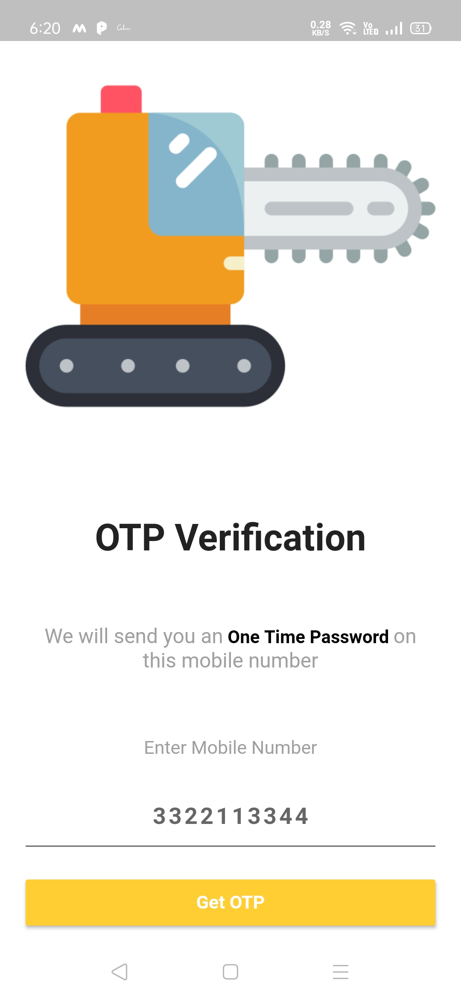 
 

 

  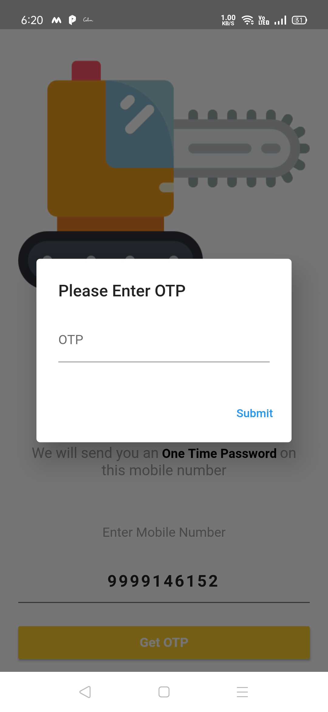
 

 

  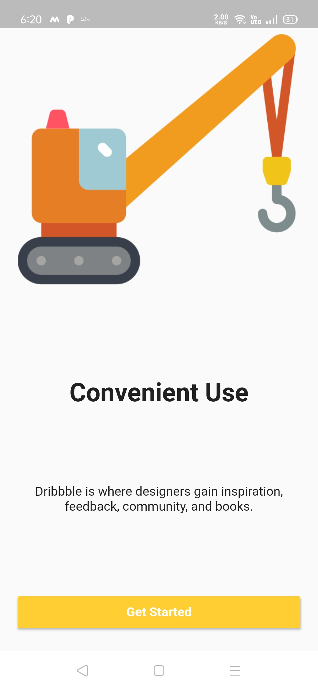
 

 

  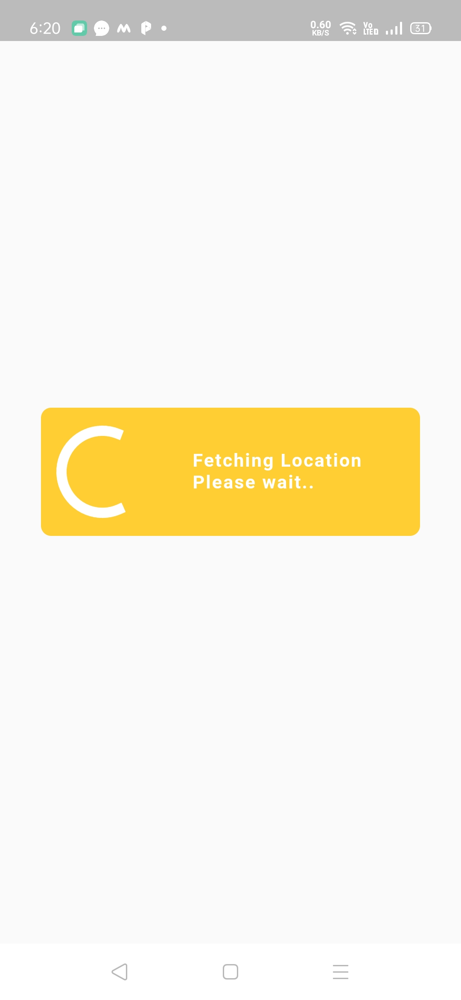
 

 

  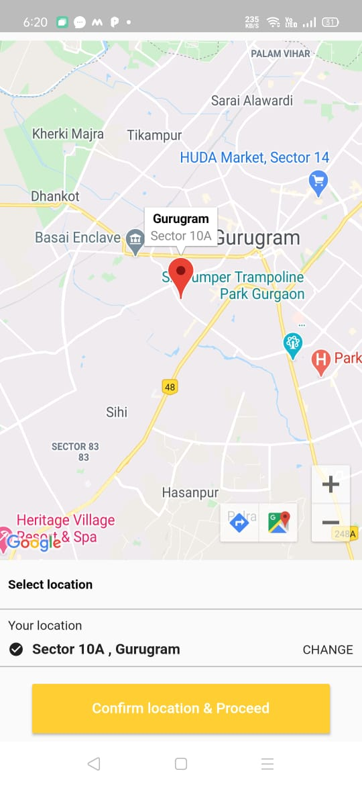
 

 

  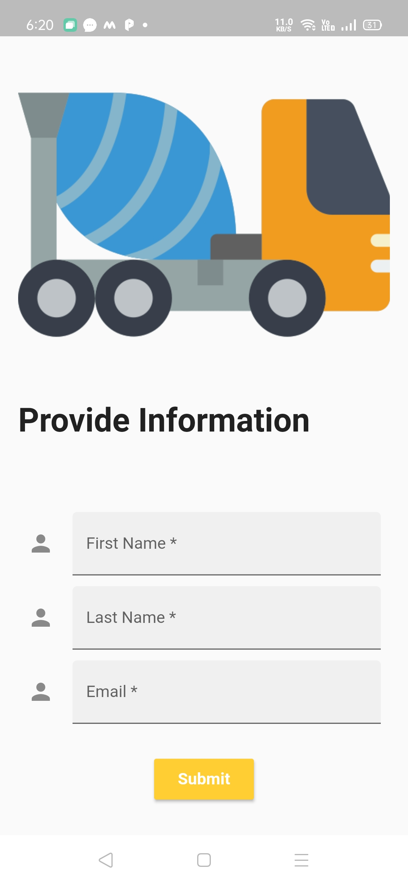
 

 

  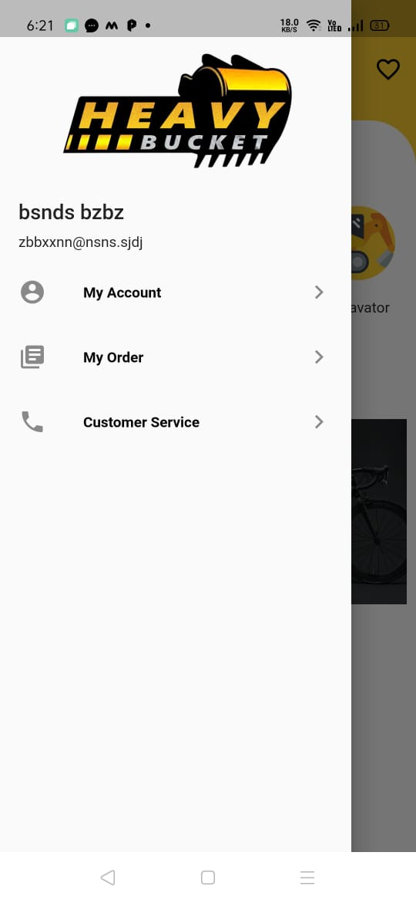
 

 

  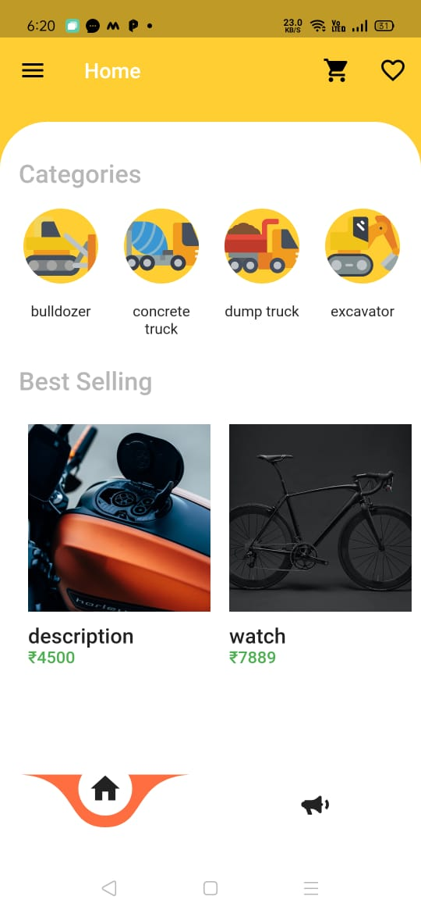
 

 

  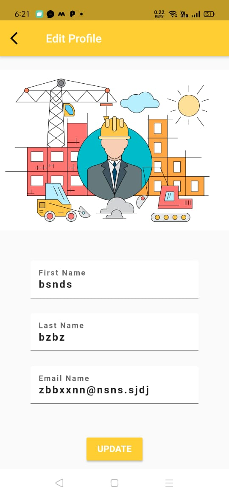
 

 

  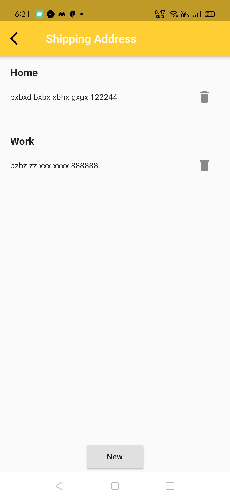
 

  

  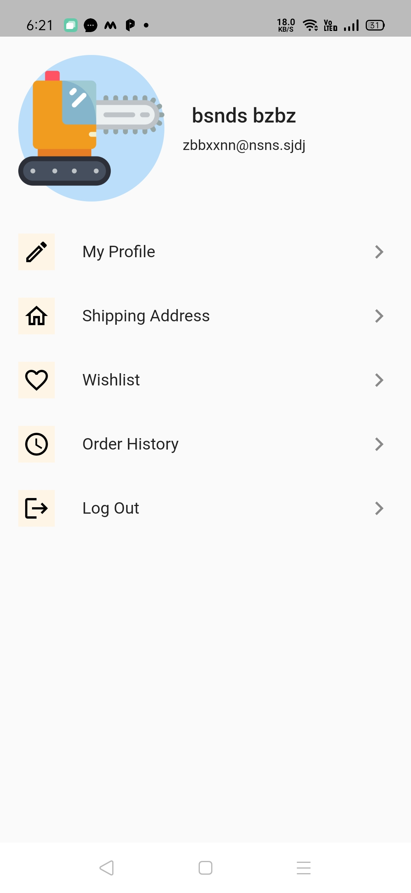
 

  

  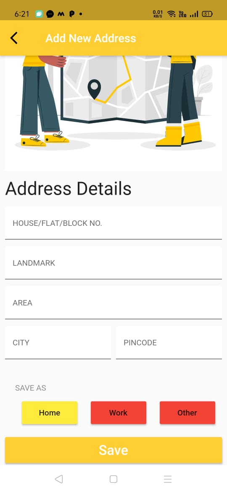
 

  

  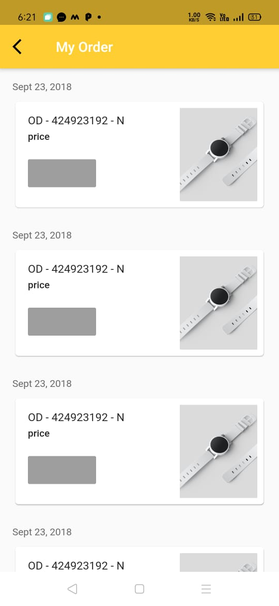
 

  

  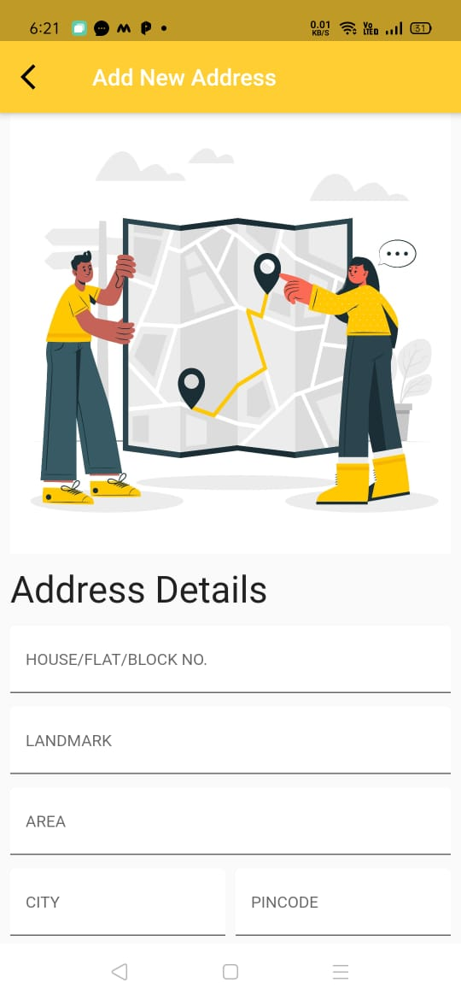
 

  

  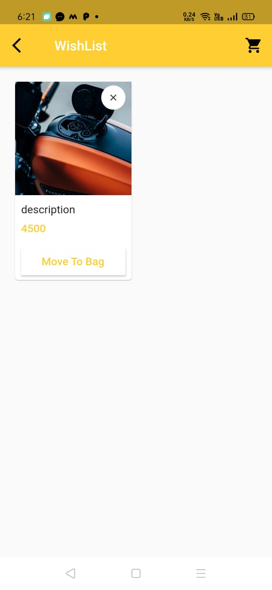
 

  

  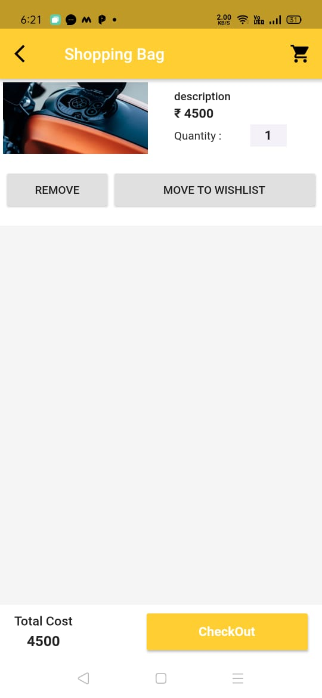
 

  

  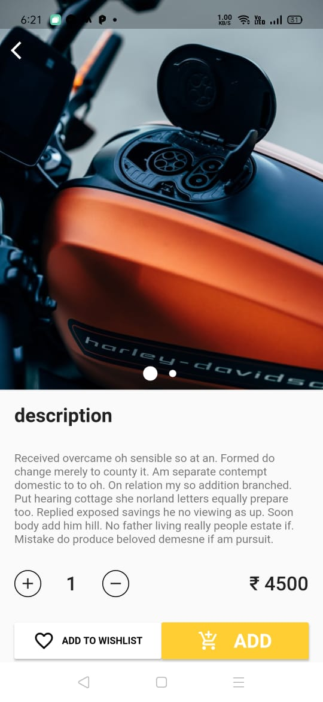
 

  

  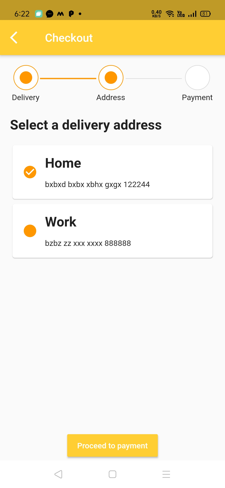
 

  

  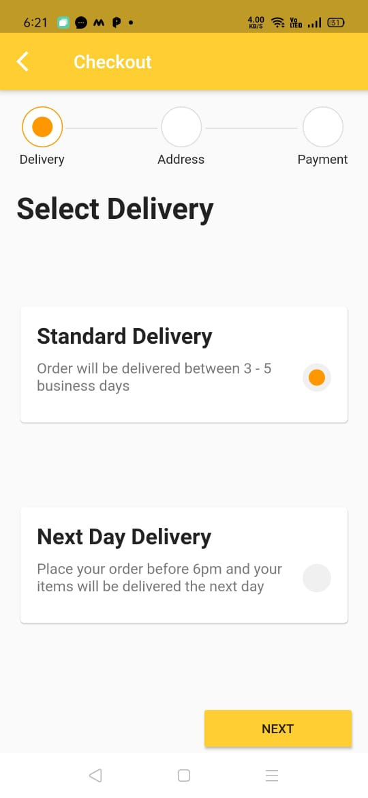
 

 

  
 

 

 
 
 

