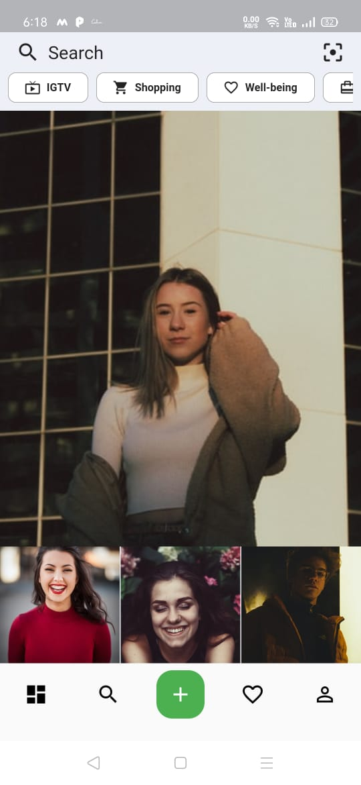

# This is project on Insta-Clone
### Short intro:
* This is just UI that i created on flutter with static data.
* The design inspiration is from dribble.
 ### Technology used:
 * Flutter
 * Dart
 
 ### Database used:
 * Firebase Database
 
 ### Screenshorts:
 

   
 

 

  
 

 

  
 

 

  
 

 

  
 

 

  
 

 

  
 

 

  
 

 

  
 

 

  
 

 

 
 
 
