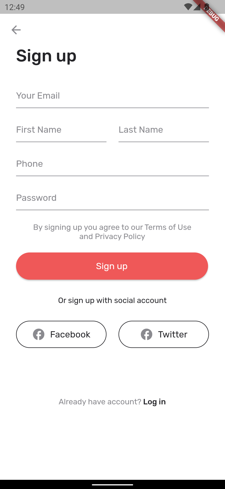
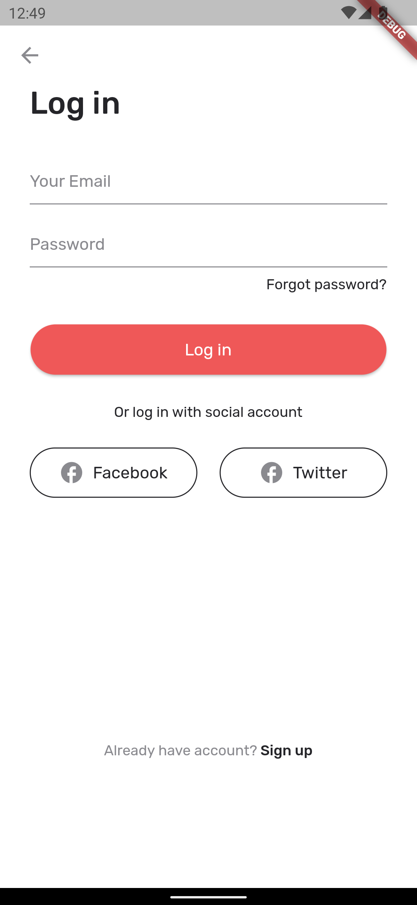
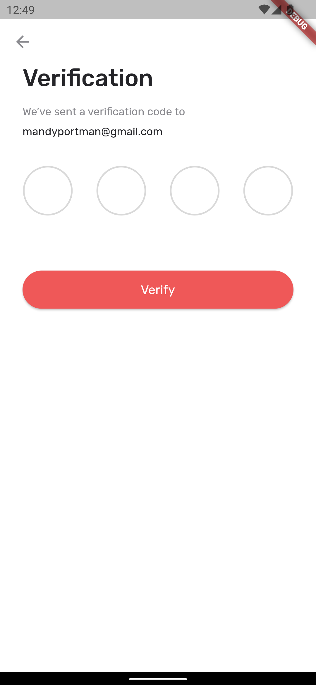
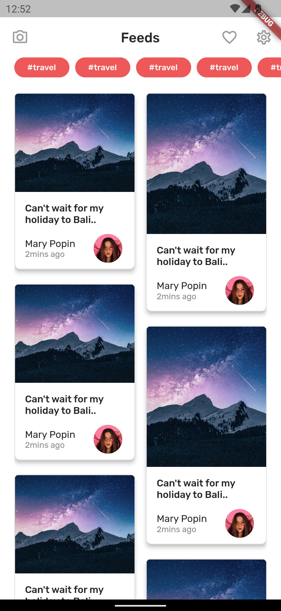
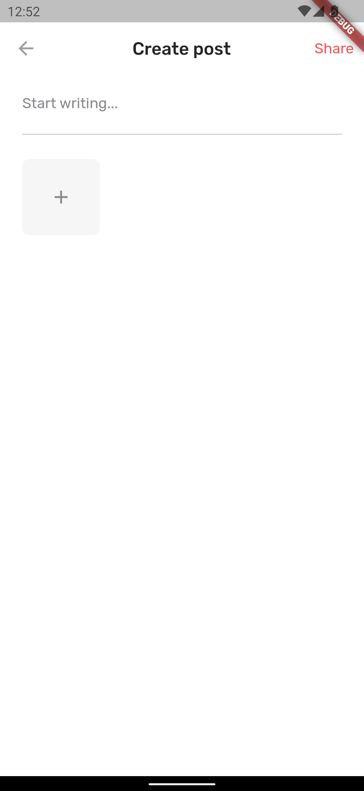
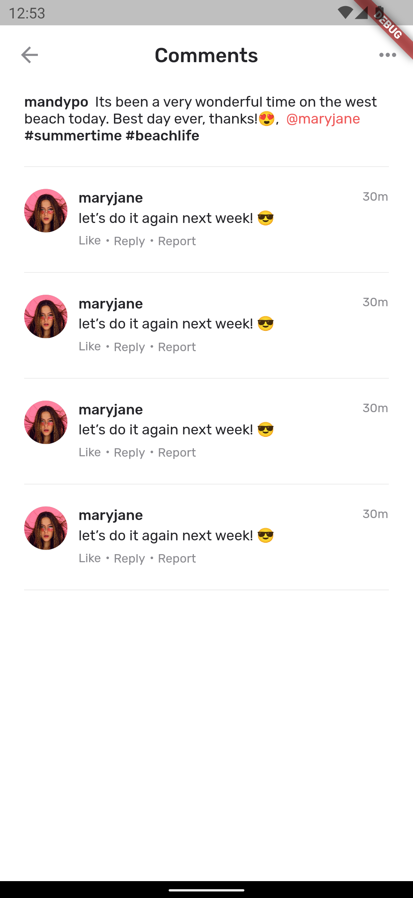

# This is project on Social Media App
### Short intro:
* This is just UI that i created on flutter with static data.

 ### Technology used:
 * Flutter
 * Dart

 
 ### Screenshorts:
 

   
 

 

  
 

 

  
 

 

  
 

 

  
 

 

  
 

 

  
 

 

  
 

 

  
 

 

 
 
 
